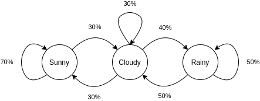
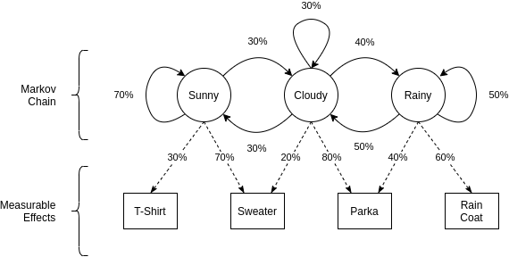
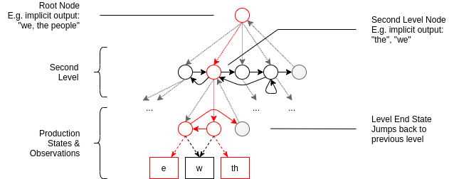

# Hierarchical Hidden Markov Models
#### An approximation of neocortex structures, according to Ray Kurzweil

In [a recent post](https://www.kurzweilai.net/dialogue-a-conversation-on-creating-a-mind), famous futurist Ray Kurzweil mentions that - in his opinion - brain structures in the [neocortex](https://en.wikipedia.org/wiki/Neocortex) are technically similar to hierarchical hidden Markov models (HHMM).
An idea he also explained in more detail in his 2012 book "How to Create a Mind" [1].

Unfortunately though, neither the article nor the book has enough information to understand this machine learning model in detail, let alone implement it.
A pity for any hobby AI scientist interested in the implementation of conscious machines!

So, let's use this article to try and understand hierarchical hidden Markov models.
We'll have a brief, high-level look at most of the concepts it builds on and prepare the stage for an actual implementation (which will follow in another article due to content length).

Hierarchical hidden Markov models are, as the name implies, based on hidden Markov models, which are in turn based on Markov chains, all of which are stochastic processes.
We'll start with the last concept and work our way backwards.

*NB: This is a light-weight introduction to the HHMM topic. We'll stick to examples and simple concepts and defer the math to the point when we're implementing this in the follow-up article.*

## Stochastic Processes, A Brief Intro

As mentioned before, all of the things we'll look at in this article are stochastic processes.
I'm sure you might already know what that is, but as it's fundamental to the whole article, let us briefly take a look at it again:

[Wikipedia defines stochastic processes](https://en.wikipedia.org/wiki/Stochastic_process) informally as:

> a sequence of random variables

To build an understanding of what this means, picture a certain type of random event, like the weather or a coin flip, measured or observed in sequence, for example once daily, or for 10 consecutive flips.
When trying to describe this mathematically, we can make use of a stochastic process.
We'd simplify the real-world phenomenon and try to calculate probability distributions for future states of it.

As a difference to [statistical models](https://en.wikipedia.org/wiki/Statistical_model), this will include an element of iteration: Previous states affect the current observations.
Did it rain today? Then, based on experience, there is a high probability that it might at least be cloudy tomorrow.

On a side note, I have the feeling this also more closely resembles how we build models mentally: Instead of thinking of smooth function-like relationships of input to output variables (linear or otherwise), we tend to think in if-x-happens-now-then-y-might-happen-later kind of models.

E.g. instead of thinking 

> If I observe that the temperature is ABC and the air pressure is XYZ, changing at the rate of UVW, then within 3 hours and 20 minutes (give or take 10 minutes) I can expect rain to come with an intensity of DEF.

we'd probably rather think 

> It was cloudy all day long and seems to be getting darker and colder, so there's a good chance we'll have rain soon.

This happens not just because we don't sit down with a thermometer, barometer and stopwatch to predict the weather, but also because it's somehow really hard to build and use these kind of functional models mentally.
I assume this is related to Kahneman's ideas in "Thinking Fast, Thinking Slow" [2], from which I take that we usually prefer using quick pattern-matching thoughts over slow, analytical ones - but I cannot provide any scientific evidence for this.

In any case, the theory of stochastic processes is a lot richer than the examples might imply.
However, for understanding HHMMs we don't need all of that detail right now.

Based on these ideas it will now be almost trivial to understand Markov chains - promised!
So without further ado, let's jump into this next topic now.

## Markov Models & Chains

A [Markov model](https://en.wikipedia.org/wiki/Markov_model), named after the Russian mathematician [Andrey Markov](https://en.wikipedia.org/wiki/Andrey_Markov) is a stochastic model (or process) with a specific property - called, who would have guessed, the Markov property - that requires a future state of the process to be depending only on the current state.

Let's go back to the weather and model it simplistically with only three states (that we check for each morning): 'Sunny', 'Cloudy' and 'Rainy'.
Now, by writing down our observations over a period of time and counting how often e.g. 'Cloudy' followed after 'Sunny', we can create a model similar to this one:

**State transition probability diagram of a simple weather model. Note that all transitions from one state to another only depend on the current state and their probabilities sum up to 100%. (Graphic by author)**

With this, we defined a simple [Markov chain](https://en.wikipedia.org/wiki/Markov_chain).
That is to say, we included the simplified states of the system modeled and their transition probabilities. This also clearly shows the Markov property: The probabilities rely only on the current state.

Let's stick with this concept a little longer and look at another example:  
Simplified text generation.

We can regard text as a sequence of words (and punctuation), where certain combinations of words are more probable than others - i.e. some words are more likely to follow one another than others.
This can be represented by a Markov chain to a certain degree by simply reading in sample texts and counting word-to-word occurrences. (Here: The start of Moby Dick by Herman Melville)

> **Call** **me** Ishmael.  Some years ago - never mind how long precisely - having little or no money in my purse, and nothing particular to interest **me** on shore, I thought I would sail about a little and see the watery part of the world.

- Call -> me (100%)
- me -> Ishmael (50%)
- me -> on (50%)
- ...

And so forth. This can also be extended to several words, i.e. finding the next word after a combination of two or more words (also known as 2-grams or [n-grams](https://en.wikipedia.org/wiki/N-gram) respectively).

Not only does this allow us to build a stochastic model of the studied text, we can also use it to generate more like it: Start with a random start word and pick next words with the recorded probabilities.

## Hidden Markov Models

To build a Markov chain as discussed in the earlier section, we need to be able to directly observe the occurrences of the states.
To continue from the last example: In order to create the word-to-word probability model, you need to read-in lots of text, i.e. lots of word-to-word pairs.

But many things in the world are not directly observable, and we can only estimate what is going on by looking at what measurable effects these 'hidden' states have.

To go back to the example with the weather, you could imagine standing indoors looking out through the window and trying to estimate whether it's cold enough to wear a coat, hat and mittens, or whether you could still go outside just dressed in a sweater.
If you don't have access to a thermometer and can't feel the temperature, you can still reason about it by looking at its effects: E.g. what other people are wearing or if there is snow and frost outside.

Modeling these unobservable processes and their effects is what [hidden Markov models](https://en.wikipedia.org/wiki/Hidden_Markov_model) were made for.
Intuitively, based on what we learned before, they consist of a Markov chain at their core, with states and the probabilistic transitions.
The twist now lies in the fact that these states of the system cannot be observed or measured, giving us no easy way to calculate the transition probabilities directly.
However, instead of that, we can measure other effects the states cause.
These effects are themselves probabilistic.

Let's look at the weather again and what potential effects it might have on the world:

**State transition diagram of 'hidden' Markov chain with effects and probabilities thereof. Note that one state can potentially have more than one observable effect, which leads to the problem that states cannot be directly inferred from observations. (Graphic by author)**

In this example, we again have three states of underlying weather (a bit simplistic, but oh well). However, this time we also show their observable effects on the world (in this case, what people are wearing) and the probabilities of seeing them.

Note that Markov Chains can be conceptually modeled as HMMs as well. If each state only results in exactly one observation with certainty (100% of the time) then we're back at the simpler Markov chain model.

### Typical Applications

Models like this are usually used for predictions in two different ways:

1. Estimating the probability of a certain sequence of observations. E.g. how likely is it to observe people wearing "Sweater" -> "Rain Coat" -> "Sweater" -> "Rain Coat"? I guess it also depends on whether or not you're in the UK...
2. Based on a sequence of observations, try estimating the sequence of states that it stems from. E.g. if you see "T-Shirt" -> "Sweater" -> "T-Shirt", the states of the world were most likely "Sunny", "Sunny", "Sunny". Nice!

That is, if you already created the model and inferred its parameters.
If that's not done yet, you face another challenge:

3. Given a model structure (i.e. states, transitions and effects) and a bunch of observation sequences, try finding the most likely probabilities for all the 'arrows'. Which is to say, train the model.

Last but not least, a rarely mentioned use is data creation:

4. Use an existing trained model and a start state (chosen based also on model parameters) to iterate through the states of the model. Choose next states (and output) based on the probabilities recorded within the model.

It goes without saying, all of these problems have been addressed for many years now and formulas are well known. We'll go through them in more detail when we implement them.

## Hierarchical Hidden Markov Models

So far we only looked at an extremely simple HMM of some states of the weather.
It's simple, yet illustrates the point of the model quite clearly.
Let's do the same for hierarchical hidden Markov models as described in the 1998 paper by Fine et al. [3].

HMMs can be understood, as we have seen, as a directed graph of states where each state is reachable. The hierarchical version is, in a sense, more restricted yet more complex at the same time. (Actually, the authors of [3] also mention that an HHMM can be represented as a fully-connected HMM, with the downside of loosing the semantics of the hierarchy, as we will see).

So what is a hierarchical hidden Markov model then?
Simply put, as the name implies, a hierarchical HMM adds a tree-like hierarchy to the hidden states.

It starts with a root node representing the top (or first) layer, which has possible state transitions to each state of a second layer of states.
The second layer in itself is structured like a Markov chain, i.e. the states have transitions with each other.
Each state in that layer however, can be the root node of another HHMM.

This goes down recursively until we reach the leaf nodes, dubbed production states, that behave like 'normal' HMM states, in that they output a single observation or symbol. They, too, are connected.

There is one last special 'end' state in each layer, that, when reached, automatically (with 100% probability) jumps back to the parent state one level above.

In terms of order, state transitions go deeper first. Then, when the signal comes back through the lower-level end state, other states on the same level are activated.
With this structure, non-production states don't have a directly assigned output. However, their output is implicitly described by the sequence of outputs of the lower-level production states.

To illustrate the point, think about the production nodes like being letters or characters in a text. Higher-level nodes could then progressively represent syllables, words, word combinations, sentences and so on.
This is the nature of the hierarchy here: It is used to represent abstractions over simpler concepts.

The aforementioned paper uses the approach to train the model on an English text corpus, which shows the ideas quite nicely.
Let's use that example and picture how a part of such a network could look like:

**State transitions and example path within a simplified hierarchical hidden Markov model. Here, we show text production going from letters or letter combinations to short words to parts of a sentence. Probabilities are not included to enhance legibility. (Graphic by author)**

In the example above we traced a production path from root node over a second level down to production states that will output letters (or letter combinations).

Each gray arrow going downward is a 'vertical' transition, and will be taken - if possible - before any of the black 'horizontal' arrows are considered.
That means both the probabilities of the gray arrows as well as the probabilities of the black arrows of a state must respectively sum up to 1.

The partial path marked in red would then produce the word 'the' as the implicit output of the activated state of the second level.
This production could then continue through other states of the second layer, until it finally jumps back to the root node and the emission of characters is done.

### Relation to the Human Brain

According to Kurzweil, these hierarchies of pattern matchers and/or output producers are how we can picture the structure of the human neocortex on a conceptual level [1].
This is the part of our brain that takes on complex tasks, such as language understanding and production.

In the text generation model, the higher in the hierarchy we go, the more complex the output will be.
Lowest-level production states will generate some single letters, while on the level of the root node, we could expect to see entire sentences.

Kurzweil mentions that there are similar hierarchies in the neocortex.
They handle language processing from parts of words up till concepts like humor and irony on the top most level.
This similarity is why he suggests HHMMs as a possible basis for modeling a conscious mind.

### Uses

Generally speaking, HHMMs and HMMs both are used in similar areas: Wherever sequential data is not directly recordable, but something else is.
The point of the model, then, is to infer the actual data from whatever other effect has been recorded.

A very famous example for this (practically since the 1970's) is speech recognition and speech synthesis.
There, short sequences of sound are analyzed using a Fourier transformation and 'translated' into the most likely phonemes and - on a higher level - words from a known vocabulary.

These algorithms have continuously improved since then and enable us now to use voice assistants like Siri or Alexa on our mobile devices.

For some more inspirations, [wikipedia has a longer list of applications here](https://en.wikipedia.org/wiki/Hidden_Markov_model#Applications).

### Limits

#### Topology

As Kurzweil mentions in the article, so far we expected to know upfront what the topology of the network looks like (i.e. how many internal states and levels there are and how states are connected).
Given this information, we can then use the mentioned algorithms to train the model and extract useful information from it.

But this upfront knowledge of the network topology rarely exists.
How would we, e.g. have to structure the network to correctly produce English sentences of a certain length?
Even without assigning probabilities, this is an incredibly hard task.

Experiments by the authors of [3] show that small changes in the structure of the hierarchy can influence the quality of the language analysis capabilities of the network by quite a bit.

One solution employed for speech recognition, is to start creating small parts of the network that would only recognize single words, and aggregate these into a larger model.

Kurzweil also mentions a genetic-algorithm-based approach to improving network topology, which, I assume, is just one of many applicable optimization techniques.

#### State Space

With the examples we were looking at, both the state space as well as the space of possible outputs was both discrete and finite.
This means that we have a set number of states and observations arranged in our aforementioned network topology.

I'm not sure if HHMMs would be generalizable beyond that, but HMMs apparently are to a certain degree. One could, for example, assume a continuous state space (think: real numbers, e.g. in a multidimensional vector to designate a state).

This does not seem relevant for Kurzweils ideas on simulating parts of the brain though, so we'll not go into detail on that part.

#### Transition and Output Probabilities

Another limit to these models stems from the Markov property itself: Since the probabilities are static and depend only on the current state, there is no way to include time-depedent, contextual information into what the model outputs.

This would be especially interesting for text generation using an HHMM or HMM, since it would enable us to learn to 'respond' to outside stimulus.

Imagine, for example, that you have a gigantic HHMM that can produce elaborate text about a variety of topics.
If you would like to use that model in a conversational interface (say, a chat bot for example), it would be great to be able to learn _with what_ to respond depending on what the user asked.
Interestingly, this has been explored already in so-called Input/Output HMMs [4].

## Next Steps

As mentioned, I'll continue this topic with a more technical article illustrating an implementation of an HHMM, based on the research presented in [3].
My hope is to reproduce (in a tutorial style article) some of their results on natural language analysis.
In the best case, we can see how sample texts can be mapped onto some nice hierarchy-level dependent abstractions.

---

All finished source documents, notebooks and code related to this is also available on [Github](https://github.com/ephe-meral/hhmm). Please feel encouraged to leave feedback and suggest improvements.

---

[1] R. Kurzweil, "How to create a mind: The secret of human thought revealed" (2012), Penguin
[2] D. Kahneman, "Thinking, fast and slow" (2011), Macmillan
[3] S. Fine, Y. Singer, and N. Tishby, ["The hierarchical hidden Markov model: Analysis and applications"](https://link.springer.com/content/pdf/10.1023/A:1007469218079.pdf) (1998), Machine learning 32.1 (pp. 41-62)
[4] Y. Bengio, and P. Frasconi, ["An input output HMM architecture"](http://www.iro.umontreal.ca/~lisa/bib/pub_subject/finance/pointeurs/iohmms.pdf) (1995), Advances in neural information processing systems (pp. 427-434)
